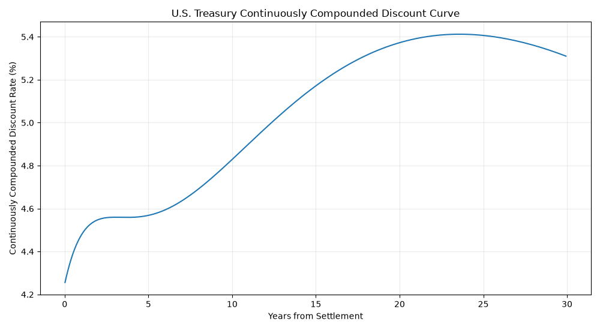

# PLOT

# Table
The table is linked in the Zero_Coupon_Yield_Curve Excel file. 

# Methodology
The goal of Mini Project 2 is to develop a detailed automated algorithm to determine the continuously compounded discount rate for each bond payment date (coupons and  principal)

=
The algorithm that we decided to use is the Nelson-Siegel-Svensson continuously compounded zero-coupon rate curve. This model works by taking in an array of time periods (t) and a set of six parameters (p) to generate a continuously compounded zero-coupon discount rate for each time period. The six parameters (b0, b1, b2, b3, tau1, tau2) control the macroeconomic shape of the curve: its long-term level, short-term slope, and two humps (curvature) across medium-term maturities.